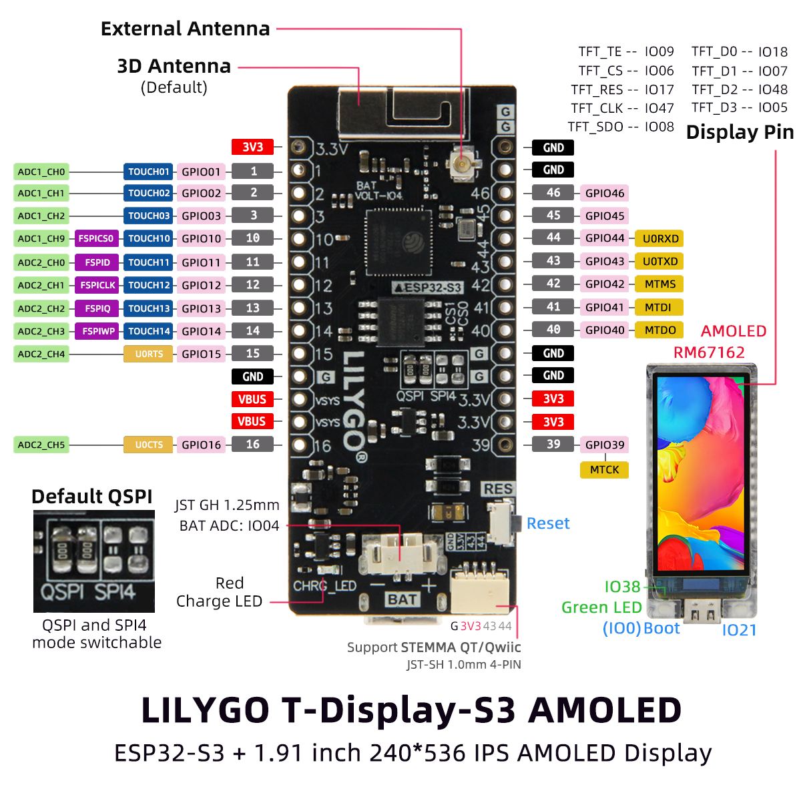
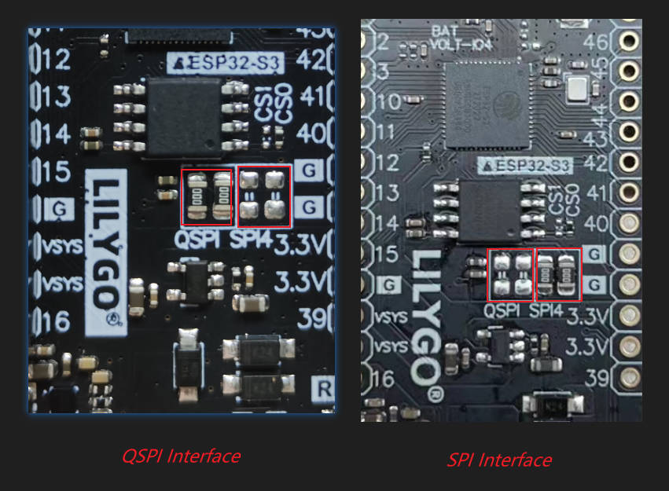

<h1 align = "center"> 🌟T-Display-S3- AMOLED🌟</h1>

# News

**This warehouse only supports the non-touch version of T-Display-S3-AMOLED. The touch version is not supported. Please go [LilyGo-AMOLED-Series](https://github.com/Xinyuan-LilyGO/LilyGo-AMOLED-Series) for the touch version.**

## Description

T-Display-S3-AMOLED is an ESP32-S3 development board. Equipped with a new AMOLED high-resolution color LCD screen and 2 programmable keys. Communication adopts SPI or QSPI interface. Keep the same layout design as T-Display. You can directly use ESP32S3 for USB communication or programming.

## Pinout

## Where to buy

T-Display-S3-AMOLED is available from: [LILYGO](), [Amazon]() and [Aliexpress]().

## Quick Start

The board uses USB as the JTAG upload port. When printing serial port information on USB, CDC_ON_BOOT configuration needs to be turned on. 
If the port cannot be found when uploading the program or the USB has been used for other functions, the port does not appear. 
Please enter the upload mode manually. 
-  Press and hold the BOOT button when the power is off, the button is located behind the RST button.
-  When the USB is connected, first press and hold the BOOT button, then click reset and then release the BOOT button

### Arduino

1. In Arduino Preferences, on the Settings tab, enter the `https://raw.githubusercontent.com/espressif/arduino-esp32/gh-pages/package_esp32_index.json` URL in the `Additional boards manager URLs` input box. 
2. Click OK and the software will install. 
3. Search for ESP32 in Tools → Board Manager and install ESP32-Arduino SDK (version 2.0.3 or above)

4. Copy everything from this repository lib folder to [Arduino library folder](https://docs.arduino.cc/software/ide-v1/tutorials/installing-libraries#manual-installation) (e.g. `C:\Users\YourName\Documents\Arduino\libraries`)
5. Select the correct settings in the Tools menu as shown below.

| Setting                  | Value                            |
| :----------------------- | :------------------------------- |
| USB CDC On Boot          | Enabled                          |
| CPU Frequency            | 240MHz (WiFi)                    |
| Core Debug Level         | None                             |
| USB DFU On Boot          | Enabled                          |
| Events Run On            | Core 1                           |
| Flash Mode               | QIO 80MHz                        |
| Flash Size               | 16MB (128Mb)                     |
| JTAG Adapter             | Integrated USB JTAG              |
| Arduino Runs On          | Core 1                           |
| USB Firmware MSC On Boot | Disabled                         |
| Partition Scheme         | Huge APP (3MB No OTA/1MB SPIFFS) |
| PSRAM                    | OPI PSRAM                        |
| USB Mode                 | Hardware CDC and JTAG            |

### PlatformIO

1. PlatformIO plug-in installation: click on the extension on the left column → search platformIO → install the first plug-in
2. Click Platforms → Embedded → search Espressif 32 in the input box → select the corresponding firmware installation

### ESP-IDF

The installation method varies depending on the system, refer to the [official manual](https://docs.espressif.com/projects/esp-idf/en/latest/esp32/get-started/index.html) for installation.

## Q&A
 
1. There are two ways to drive the screen. One is the traditional `SPI` (CS, MOSI, SCLK, DC) interface. One is to use the `QSPI` method (CS, SCLK, D0, D1, D2, D3). The QSPI method can increase the driving speed by four times compared with the SPI. to fit the larger screen.
- Here you can choose to use traditional SPI or new QSPI mode.
    
- To use the SPI interface, you need to set **LCD_USB_QSPI_DREVER** to **0** in [pins_config.h](./examples/factory/pins_config.h)

## FAQ

1. The board uses USB as the JTAG upload port. When printing serial port information on USB_CDC_ON_BOOT configuration needs to be turned on. 
If the port cannot be found when uploading the program or the USB has been used for other functions, the port does not appear. 
Please enter the upload mode manually. 
   1. Connect the board via the USB cable
   2. Press and hold the BOOT button , While still pressing the BOOT button, press RST
   3. Release the RST
   4. Release the BOOT button
   5. Upload sketch

2. If the above is invalid, burn the [binary file](./firmware/README.MD)  to check whether the hardware is normal
   - [Video](https://youtu.be/L-W3dCMtEdo)